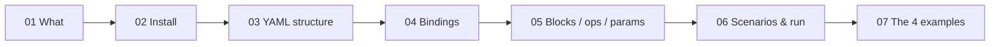

# NoSQLBench Guide (Cassandra)

> What NoSQLBench is, how to install it (Docker or executable), and how to write workload YAML files, with 4 runnable examples.



## Map

| # | Topic | One line | File |
|---|---|---|---|
| 01 | What is NoSQLBench | YAML in → DB load + latency out | [01](docs/01-what-is-nosqlbench.md) |
| 02 | Install | Docker image or `nb5.jar` / Linux binary | [02](docs/02-install.md) |
| 03 | YAML structure | Build a workload level by level | [03](docs/03-yaml-structure.md) |
| 04 | Bindings | cycle → data functions | [04](docs/04-bindings.md) |
| 05 | Blocks, ops, params | What runs, grouped, with which settings | [05](docs/05-blocks-ops-params.md) |
| 06 | Scenarios & running | schema → rampup → main + CLI | [06](docs/06-scenarios-and-running.md) |
| 07 | Examples | Walkthrough of the 4 YAMLs | [07](docs/07-examples.md) |

## Examples

| File | Shows |
|---|---|
| [01-stdout-hello.yaml](examples/01-stdout-hello.yaml) | Bindings, no DB |
| [02-cql-keyvalue.yaml](examples/02-cql-keyvalue.yaml) | Full 3-phase Cassandra workload |
| [03-cql-timeseries.yaml](examples/03-cql-timeseries.yaml) | Typed columns, time-series |
| [04-cql-antipatterns.yaml](examples/04-cql-antipatterns.yaml) | Bad vs good design, 2 scenarios |

## Quick Start

```bash
docker compose -f docker/docker-compose.yml up -d        # Cassandra on :9042, network nb-net
docker run --rm -v "${PWD}:/work" nosqlbench/nosqlbench /work/examples/01-stdout-hello.yaml
docker run --rm --network nb-net -v "${PWD}:/work" nosqlbench/nosqlbench \
  /work/examples/02-cql-keyvalue.yaml default host=cassandra localdc=datacenter1
```
Without Docker for nb5 → [02-install.md](docs/02-install.md) (Java 25 + `nb5.jar`, or the Linux `nb5` binary).
