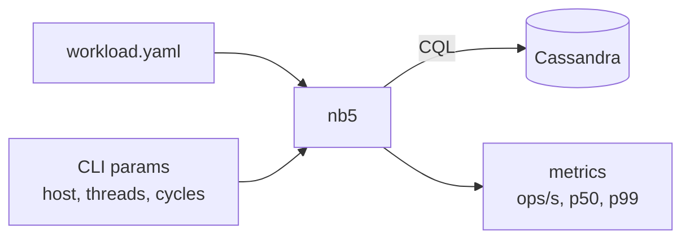
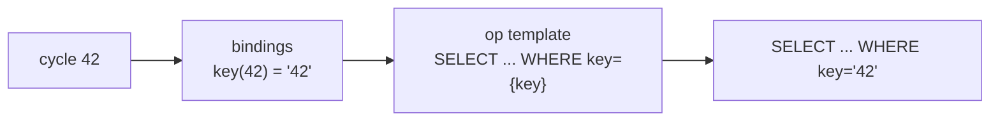

# 01 · What is NoSQLBench

> A load-testing tool for databases. You describe the workload in **one YAML file**; `nb5` turns it into millions of ops against Cassandra (or other DBs) and measures latency.

## The one idea to remember

Every op has a number called a **cycle** (`0, 1, 2 … N-1`). The YAML turns each cycle into a query:

Same cycle → same data → every run is **reproducible**.

## Words you'll see

| Word | Meaning |
|---|---|
| `cycle` | Op number `0..N-1` |
| `binding` | Function: cycle → value |
| `op` | Query template with `{placeholders}` |
| `block` | Group of ops (e.g. `rampup`) |
| `scenario` | Ordered steps: schema → rampup → main |
| `driver` | Target: `cql` (Cassandra), `stdout` (print only) |

Next → [02-install.md](02-install.md)
