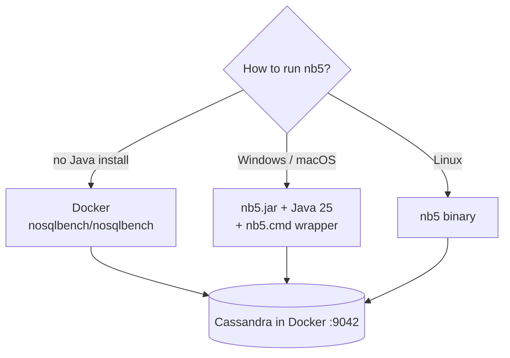

# 02 · Install (Docker or executable)

> Two ways to get `nb5`. Both take the same arguments.



## Step 0 — Cassandra (needed by examples 02–04)
```bash
docker compose -f docker/docker-compose.yml up -d
docker exec -it cassandra nodetool status        # wait for "UN" (~30–60 s)
```
The compose file creates the network **`nb-net`** so an nb5 container can reach `cassandra` by name.

---

## Option A — Docker (nothing else to install)
```bash
docker pull nosqlbench/nosqlbench
docker run --rm nosqlbench/nosqlbench --version
```

Run a local YAML → mount the repo at `/work`:
```powershell
# PowerShell (from repo root)
docker run --rm -v "${PWD}:/work" nosqlbench/nosqlbench /work/examples/01-stdout-hello.yaml

docker run --rm --network nb-net -v "${PWD}:/work" nosqlbench/nosqlbench `
  /work/examples/02-cql-keyvalue.yaml default host=cassandra localdc=datacenter1
```
```bash
# bash
docker run --rm --network nb-net -v "$PWD:/work" nosqlbench/nosqlbench \
  /work/examples/02-cql-keyvalue.yaml default host=cassandra localdc=datacenter1
```

| Detail | Why |
|---|---|
| `--network nb-net` | Reach Cassandra container |
| `host=cassandra` | Container name, not `127.0.0.1` |
| `/work/...` absolute path | Image runs `java -jar nb5.jar` from `/`; don't change `-w` |

---

## Option B — Executable

NoSQLBench ships **no Windows `.exe`**. On Windows use the jar + a 2-line wrapper so `nb5` works like an exe.

**Windows**
```powershell
java -version        # needs 25+ (latest nb5 is built for Java 25) → e.g. winget install EclipseAdoptium.Temurin.25.JDK
curl.exe -L -o nb5.jar https://github.com/nosqlbench/nosqlbench/releases/latest/download/nb5.jar
.\nb5.cmd --version  # nb5.cmd is in the repo root
```

[nb5.cmd](../nb5.cmd):
```bat
@echo off
java -jar "%~dp0nb5.jar" %*
```

**Linux** (self-contained binary, no Java needed)
```bash
curl -L -o nb5 https://github.com/nosqlbench/nosqlbench/releases/latest/download/nb5
chmod +x nb5 && ./nb5 --version
```

Run against Cassandra from the host:
```bash
nb5 examples/02-cql-keyvalue.yaml default host=127.0.0.1 localdc=datacenter1
```

## Useful discovery commands

| Command | Shows |
|---|---|
| `nb5 --list-drivers` | Adapters (`cql`, `stdout`…) |
| `nb5 --list-workloads` | Bundled workloads |
| `nb5 --copy cql-keyvalue2` | Copy a bundled YAML to study |
| `nb5 help cql` | cql driver params |

## Pitfall
❌ `UnsupportedClassVersionError` → Java too old → install Java 25
❌ Connection refused in Docker → forgot `--network nb-net` or used `host=127.0.0.1`

Next → [03-yaml-structure.md](03-yaml-structure.md)
