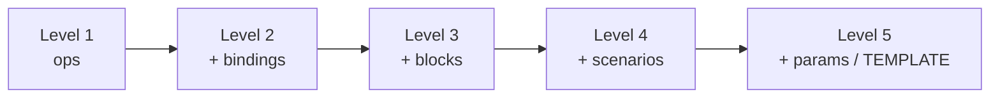

# 03 · YAML Structure — build it level by level

> A workload YAML has up to 5 top-level keys. Only `ops` (or `blocks`) is required. Start tiny, add one layer at a time.



| Key | Required | Purpose | Details |
|---|---|---|---|
| `description` | ❌ | Text shown in `--list-workloads` | — |
| `scenarios` | ❌ | Named, ordered run steps | [06](06-scenarios-and-running.md) |
| `params` | ❌ | Defaults for every op | [05](05-blocks-ops-params.md) |
| `bindings` | ❌ | cycle → value functions | [04](04-bindings.md) |
| `ops` / `blocks` | ✅ | The operations | [05](05-blocks-ops-params.md) |

---

## Level 1 — just an op
```yaml
ops:
  hello: "hello world\n"
```
```bash
nb5 run driver=stdout workload=level1.yaml cycles=3
# hello world ×3
```

## Level 2 — add data with bindings
```yaml
bindings:
  id:   Identity()                        # 0,1,2...
  name: Mod(1000); ToString() -> String   # "0".."999"
ops:
  hello: "id={id} name={name}\n"          # {x} = binding x
```

## Level 3 — group ops into blocks
```yaml
bindings:
  key: Mod(1000); ToString() -> String
blocks:
  write:                                  # block name → tag block:write
    ops:
      insert: "INSERT key={key}\n"
  read:
    ops:
      select: "SELECT key={key}\n"
```
```bash
nb5 run driver=stdout workload=level3.yaml tags==block:read cycles=3   # only reads
```

## Level 4 — scenario = no long command lines
```yaml
scenarios:
  default:
    load: run driver=stdout tags==block:write cycles=5
    read: run driver=stdout tags==block:read  cycles=5
# (+ bindings and blocks from Level 3)
```
```bash
nb5 level4.yaml            # runs "default": load, then read
nb5 level4.yaml default.read
```

## Level 5 — shared params + CLI-tunable values
```yaml
params:
  instrument: true                        # applies to all ops
bindings:
  key: Mod(TEMPLATE(keycount,1000)); ToString() -> String
scenarios:
  default:
    load: run driver=stdout tags==block:write cycles===TEMPLATE(keycount,1000)
```
```bash
nb5 level5.yaml keycount=50        # every TEMPLATE(keycount,...) becomes 50
```

➡️ Level 5 + `driver=cql` + real CQL = [examples/02-cql-keyvalue.yaml](../examples/02-cql-keyvalue.yaml).

## Rules that break YAMLs most often

| ❌ Wrong | ✅ Right |
|---|---|
| `{key}` with no binding `key` | Every `{x}` needs `bindings.x` |
| `tags==block:schema` but no block `schema` | Each tag filter must match ≥ 1 op |
| Tabs for indentation | Spaces only |
| Multi-line CQL without `\|` | `insert: \|` then indented lines |

Next → [04-bindings.md](04-bindings.md)
