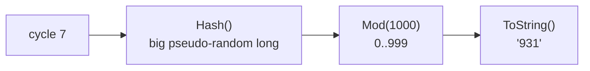

# 04 · Bindings — generating data

> A binding is a **chain of functions** applied to the cycle number. Output = value inserted into `{name}`. Pure and repeatable.



## Syntax
```yaml
bindings:
  <name>: Func1(args); Func2(args); ... -> OutputType
```
- `;` pipes output → next function.
- `-> Type` (optional) forces the final Java type — must match the CQL column type.

## The 5 building blocks

| Function | cycle 0,1,2,3… → | Use for |
|---|---|---|
| `Identity()` | 0, 1, 2, 3 | Unique ids |
| `Mod(4)` | 0, 1, 2, 3, 0, 1… | Bounded set (cardinality) |
| `Div(3)` | 0, 0, 0, 1, 1, 1… | N rows per group |
| `Hash()` | random-looking longs | Shuffle order |
| `HashRange(10,20)` | 10..20 random-looking | Numeric range |

Combine them:
```yaml
bindings:
  seq_key:  Mod(1000000); ToString() -> String          # 0..999999 in order (writes)
  rand_key: Hash(); Mod(1000000); ToString() -> String  # same 1M keys, random order (reads)
  user_id:  Div(10); ToString() -> String               # 10 rows per user
```

## Types for CQL columns

| CQL type | Binding |
|---|---|
| `text` | `...; ToString() -> String` |
| `int` | `HashRange(0,100) -> int` |
| `bigint` | `Identity() -> long` |
| `double` | `Normal(100.0,5.0) -> double` |
| `uuid` | `Mod(10000); ToHashedUUID() -> java.util.UUID` |
| `timeuuid` | `ToEpochTimeUUID() -> java.util.UUID` |
| `timestamp` | `Mul(1000L); ToJavaInstant()` (1 s per cycle from epoch) |

## Realistic values

| Goal | Binding |
|---|---|
| Fixed-length text | `AlphaNumericString(12)` |
| Pick from list with weights | `WeightedStrings('Cairo:5;Riyadh:3;Paris:2')` |
| Word from bundled list | `HashedLineToString('data/variable_words.txt')` |
| 900–1100 chars of text | `HashedFileExtractToString('data/lorem_ipsum_full.txt',900,1100)` |
| Skewed (hot keys) | `Zipf(1000000,1.1) -> long; ToString() -> String` |

## Golden rule — writes and reads share a domain
```yaml
seq_key: Mod(TEMPLATE(keycount,1000000)); ToString() -> String          # rampup writes 0..N-1
rw_key:  Hash(); Mod(TEMPLATE(keycount,1000000)); ToString() -> String  # main reads 0..N-1 ✅
# ❌ rw_key: Uniform(0,1000000000)->long; ToString() -> String  → 99.9% reads find nothing
```

## Test bindings without a DB
```bash
nb5 run driver=stdout workload=examples/03-cql-timeseries.yaml tags==block:rampup cycles=5
nb5 --list-functions            # every available function
```

Next → [05-blocks-ops-params.md](05-blocks-ops-params.md)
