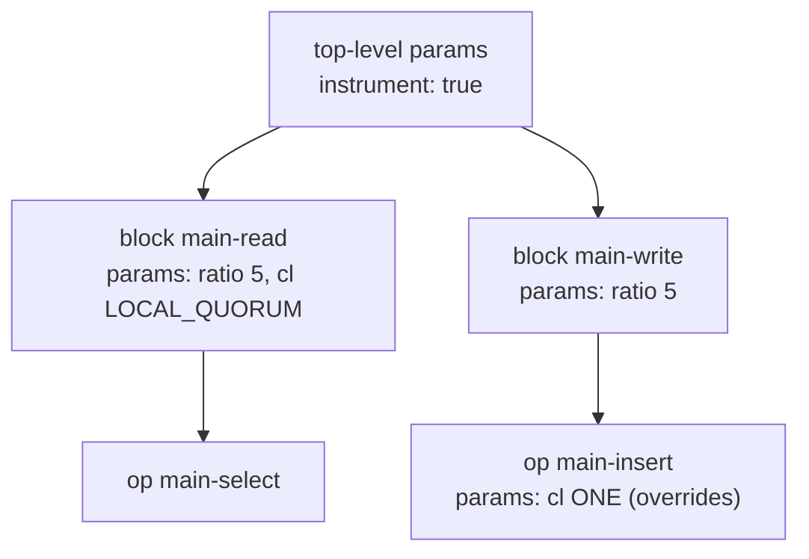

# 05 · Blocks, Ops & Params

> **ops** = what to execute. **blocks** = named groups of ops. **params** = settings, inherited top → block → op.


Most specific wins: **op > block > top-level**.

## Op: 2 forms

**String form** — enough 90% of the time:
```yaml
ops:
  main-select: |
    SELECT * FROM baselines.keyvalue WHERE key = {rw_key};
```

**Map form** — when one op needs its own settings:
```yaml
ops:
  main-select:
    prepared: |                       # cql op type: prepared | simple | raw
      SELECT * FROM baselines.keyvalue WHERE key = {rw_key};
    params:
      ratio: 3
      cl: LOCAL_ONE
```

## Block: group + shared params
```yaml
blocks:
  schema:
    params:
      prepared: false                 # DDL can't be prepared - set it yourself
    ops:
      create-keyspace: |
        CREATE KEYSPACE IF NOT EXISTS baselines
        WITH replication = {'class':'SimpleStrategy','replication_factor':1};
      create-table: |
        CREATE TABLE IF NOT EXISTS baselines.keyvalue (key text PRIMARY KEY, value text);

  main-read:
    params: { ratio: 5, cl: LOCAL_QUORUM }
    ops:
      main-select: SELECT * FROM baselines.keyvalue WHERE key = {rw_key};

  main-write:
    params: { ratio: 5, cl: LOCAL_QUORUM }
    ops:
      main-insert: INSERT INTO baselines.keyvalue (key, value) VALUES ({rw_key}, {value});
```

## Ratios → the op mix

`main-read ratio 9` + `main-write ratio 1` → a 10-op sequence repeated forever:
```
cycles 0-9   → 9 × R + 1 × W   (interleaved)
cycles 10-19 → same pattern again
```
Ratios are relative: `9/1` = `90/10` = 90% reads. `cycles` should be a multiple of the sum (10) for an exact mix.

## Params you'll use with `cql`

| Param | Values | Default | Level |
|---|---|---|---|
| `ratio` | integer | `1` | block / op |
| `cl` | `ONE`, `LOCAL_ONE`, `LOCAL_QUORUM`, `ALL` | driver default | any |
| `prepared` | `true` / `false` | `true` | any |
| `instrument` | `true` → per-op metrics named after the op | `false` | any |

## Tags — how steps pick ops

Every op automatically gets `block:<block name>`. Add your own:
```yaml
blocks:
  main-read:
    tags:
      phase: main
```

| Filter | Selects |
|---|---|
| `tags==block:schema` | block `schema` |
| `tags==block:"main.*"` | `main-read` + `main-write` (regex) |
| `tags==phase:main` | every block tagged `phase: main` |

## TEMPLATE — values changeable from the CLI
```yaml
CREATE KEYSPACE IF NOT EXISTS TEMPLATE(keyspace,baselines) ...
```
```bash
nb5 examples/02-cql-keyvalue.yaml default keyspace=test1 ...
```
Works anywhere in the file: ops, bindings, params, scenarios. Old syntax `<<keyspace:baselines>>` = same.

Next → [06-scenarios-and-running.md](06-scenarios-and-running.md)
