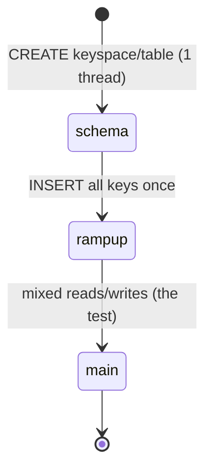

# 06 · Scenarios & Running

> A scenario is a named list of `run` steps executed in order. Each step = one activity with its own driver, tags, cycles, threads.



## Anatomy of one step
```yaml
scenarios:
  default:
    main: run driver=cql tags==block:"main.*" cycles===TEMPLATE(main-cycles,1000000) threads=auto
#   │     │   │          │                     │                                        │
#   │     │   │          │                     │                                        └ =   CLI may override
#   │     │   │          │                     └ ===  locked; CLI value silently ignored
#   │     │   │          └ ==  locked; CLI value → error
#   │     │   └ which adapter
#   │     └ command (run = start activity and wait)
#   └ step name → select with default.main
```

| Operator | CLI can override? | Use for |
|---|---|---|
| `=` | ✅ | `threads`, `cyclerate` |
| `==` | ❌ error | Rarely - blocks `threads=N` globally |
| `===` | ❌ silent | `threads===1` on schema, `cycles===TEMPLATE(...)` |

Tip: to let users change a locked value, lock a `TEMPLATE(...)` → they set `main-cycles=5M` instead of `cycles=`.

## Run commands

| Goal | Command |
|---|---|
| Default scenario | `nb5 file.yaml` |
| Named scenario + params | `nb5 file.yaml default host=127.0.0.1 localdc=datacenter1` |
| One step only | `nb5 file.yaml default.main host=... localdc=...` |
| No scenario (ad-hoc) | `nb5 run driver=cql workload=file.yaml tags==block:"main.*" cycles=100k host=... localdc=...` |
| Preview ops (no DB) | `nb5 run driver=stdout workload=file.yaml tags==block:rampup cycles=5` |

## Activity params

| Param | Example | Meaning |
|---|---|---|
| `cycles` | `1M`, `500k`, `1000..2000` | Count or range |
| `threads` | `32`, `auto` | Concurrency |
| `cyclerate` | `5000` | Target ops/s (unset = as fast as possible) |
| `errors` | `stop`, `count`, `warn,count` | On error |
| `host` / `port` / `localdc` | `127.0.0.1` / `9042` / `datacenter1` | cql connection |

## Output options

| Flag | Result |
|---|---|
| `--progress console:10s` | Progress line every 10 s |
| `--report-summary-to stdout:0` | Latency/throughput summary at end |
| `--report-csv-to results/run1` | CSV per metric |
| `--docker-metrics` | Grafana on http://localhost:3000 |

## Full example
```bash
nb5 examples/02-cql-keyvalue.yaml default \
  host=127.0.0.1 localdc=datacenter1 \
  keycount=100000 rampup-cycles=100000 main-cycles=500000 \
  threads=16 errors=count \
  --progress console:10s --report-summary-to stdout:0
```
What happens:
1. `schema` → keyspace + table (1 thread, `threads=16` ignored thanks to `===`)
2. `rampup` → 100k inserts, keys 0..99,999
3. `main` → 500k ops, 50/50 read/write on the same keys
4. Summary printed: ops/s, p50, p99…

Next → [07-examples.md](07-examples.md)
