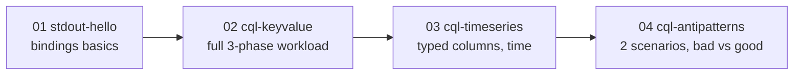
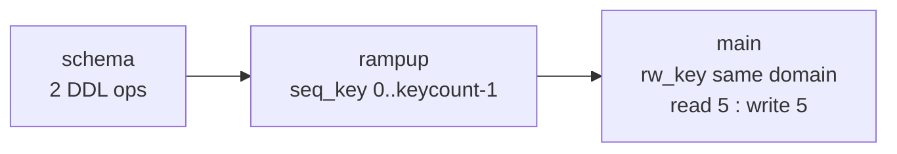

# 07 · The 4 Examples

> Each example adds one new idea. Read the YAML next to this page.



| # | File | New idea | Needs Cassandra |
|---|---|---|---|
| 01 | [01-stdout-hello.yaml](../examples/01-stdout-hello.yaml) | `ops` + `bindings`, no DB | ❌ |
| 02 | [02-cql-keyvalue.yaml](../examples/02-cql-keyvalue.yaml) | schema → rampup → main, ratios, TEMPLATE | ✅ |
| 03 | [03-cql-timeseries.yaml](../examples/03-cql-timeseries.yaml) | uuid/timestamp/double, cycle ranges | ✅ |
| 04 | [04-cql-antipatterns.yaml](../examples/04-cql-antipatterns.yaml) | multiple scenarios in one file | ✅ |

Commands below use `nb5`. Docker → replace with
`docker run --rm --network nb-net -v "${PWD}:/work" nosqlbench/nosqlbench /work/examples/...` and `host=cassandra`.

---

## 01 · stdout-hello
```bash
nb5 examples/01-stdout-hello.yaml
```
```
cycle=0 user=0 age=53 city=Cairo
cycle=1 user=1 age=27 city=Riyadh
```
| Binding | Teaches |
|---|---|
| `Identity()` | cycle as-is |
| `Mod(1000); ToString() -> String` | bounded + typed |
| `HashRange(18,80)` | repeatable random range |
| `WeightedStrings(...)` | weighted pick |

## 02 · cql-keyvalue — the template for your own workloads
```bash
nb5 examples/02-cql-keyvalue.yaml default host=127.0.0.1 localdc=datacenter1 --report-summary-to stdout:0
```

| Knob (CLI) | Default | Effect |
|---|---|---|
| `keycount` | 1000000 | Dataset size |
| `rampup-cycles` / `main-cycles` | 1000000 | Ops per phase |
| `read-ratio` / `write-ratio` | 5 / 5 | Mix |
| `keyspace`, `rf`, `read_cl`, `write_cl` | baselines, 1, LOCAL_QUORUM | Schema & consistency |

## 03 · cql-timeseries
```bash
nb5 run driver=stdout workload=examples/03-cql-timeseries.yaml tags==block:rampup cycles=5   # preview
nb5 examples/03-cql-timeseries.yaml default host=127.0.0.1 localdc=datacenter1
```
| Point | How |
|---|---|
| 10k machines | `Mod(10000); ToHashedUUID()` |
| Time grows with cycle | `Mul(1000L); Div(10000L); ToJavaInstant()` |
| Bounded partitions | `PRIMARY KEY ((machine_id, day_bucket), ...)` |
| Main adds new rows | `main-cycles` default `1000000..2000000` (continues after rampup) |
| Mix | read 1 : write 9 |

## 04 · cql-antipatterns
```bash
nb5 examples/04-cql-antipatterns.yaml bad  host=127.0.0.1 localdc=datacenter1 --report-summary-to stdout:0
nb5 examples/04-cql-antipatterns.yaml good host=127.0.0.1 localdc=datacenter1 --report-summary-to stdout:0
```
| | `bad` | `good` |
|---|---|---|
| Partitions written | 10 (hot) | 100,000 |
| Read key domain | 0..1B → almost all miss | same 100k → all hit |
| Looks | Fast (reads find nothing) | Honest |

Back → [README](../README.md)
